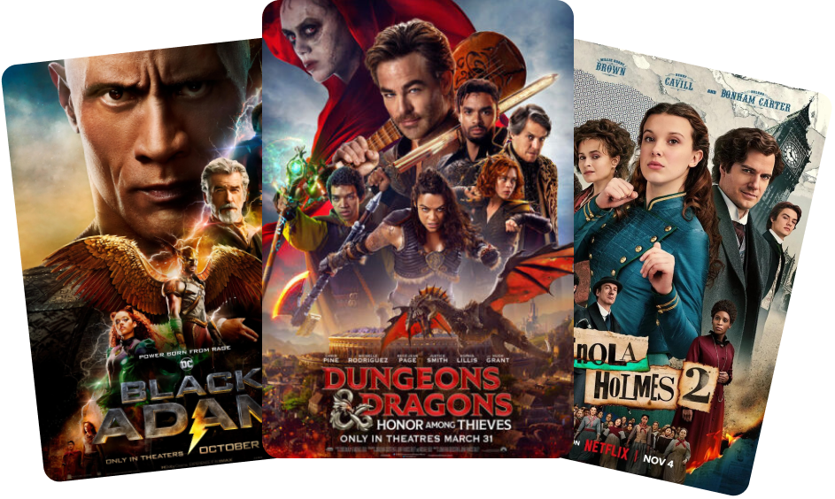

# 🎬 Project Movies

A modern, responsive web application for browsing and discovering great movies. Built with **React**, **Vite**, and **Tailwind CSS**, this app provides a seamless experience for movie enthusiasts.

## 🚀 Features

- **Movie Discovery**: Explore popular and trending movies via the TMDB API.
- **Search System**: Find your favorite movies with a debounced search bar.
- **Trending Rankings**: A dynamic trending list based on real-time user searches, powered by **Appwrite**.
- **Modern UI**: Stylish dark mode design with glassmorphism and smooth animations.
- **Responsive Design**: fully optimized for mobile, tablet, and desktop viewing.

## 🛠️ Technology Stack

- **Frontend**: [React](https://reactjs.org/) + [Vite](https://vitejs.dev/)
- **Styling**: [Tailwind CSS v4](https://tailwindcss.com/)
- **Backend & Database**: [Appwrite](https://appwrite.io/)
- **Movie Data**: [The Movie Database (TMDB) API](https://www.themoviedb.org/documentation/api)

## 📄 License

This project is open-source and available under the [MIT License](LICENSE).

---

Made with 💛 by [Gonza](https://github.com/gonzalogramagia)
